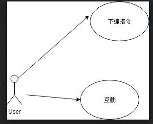

# 主題:AR寵物
---
### 專題需求:
#### 由於現代人不太生小孩，但大部分人也需要陪伴，只是不是人人都可以養寵物，所以我們要製作一個可以用手機養寵物，不但不需要有壓力的養他，還可以有所陪伴。
---
### 功能性需求:
#### 此AR須具備跟主人互動，對主人的一舉一動要有所反應，也必須要有吃喝拉撒睡的功能。
---
### 非功能性需求:
#### 此系統要依主人原本設定的存檔，主人不管想玩多久，此系統都必須存在陪伴主人。
---
### 使用案例圖:

---
### 使用案例的重要性:
#### 1.管理者
#### 2.使用者
---
### 使用案例
#### 管理者:
##### 1.開始製作
##### 2.系統更新與維護
##### 3.收集意見
#### 使用者:
##### 1.填寫意見
##### 2.跟寵物互動
##### 3.下達指令
---
### User story:
#### 希望能讓使用者再也不寂寞。
