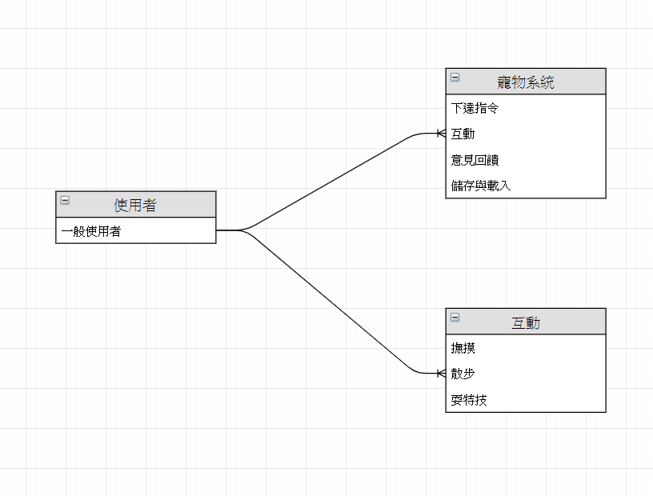

# 主題:AR寵物
---
## 專題需求:
由於現代人不太生小孩，但大部分人也需要陪伴，只是不是人人都可以養寵物，所以我們要製作一個可以用手機養寵物，不但不需要有壓力的養他，還可以有所陪伴。

---
## 功能性需求:
此AR須具備跟主人互動，對主人的一舉一動要有所反應，也必須要有吃喝拉撒睡的功能。
    
---
## 非功能性需求:
此系統要依主人原本設定的存檔，主人不管想玩多久，此系統都必須存在陪伴主人。
    
---
## 使用案例圖:

---
## 使用案例的重要性:
 - 下達指令
 - 互動
 - 儲存與載入 
 - 意見回饋
 

---
## 使用案例
### 1.下達指令:
 - 叫他吃飯
 - 叫他換裝
 - 叫他擺pose

### 2.互動:
 - 搔癢他
 - 撫摸她
 - 玩小遊戲
 
### 3.儲存與載入:
 - 儲存功能
 - 載入功能
 
### 4.意見回饋:
 - 回報BUG
 - 遊戲評分
 - 提出改善、建議與想要新增的功能

---
## User story:
 - 身為一個管理者，我希望可以透過使用者的回饋，來進行系統維護以及開發新功能。
 - 身為一個使用者，我希望可以透過下達指令，讓虛擬寵物達成我要求的動作。
 - 身為一個使用者，我希望可以透過互動，讓虛擬寵物回應我所發出的動作或訊息。

---
## 初步類別圖:

### (1)下達指令:

### (2)互動:

### (3)儲存與載入:

### (4)意見回饋:

---
## 系統循序圖:

---
## 強韌圖:

